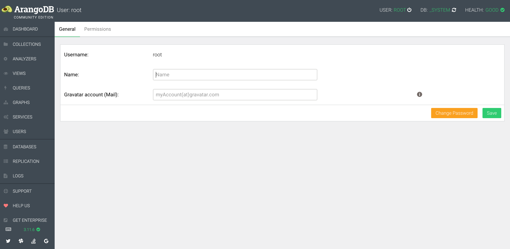
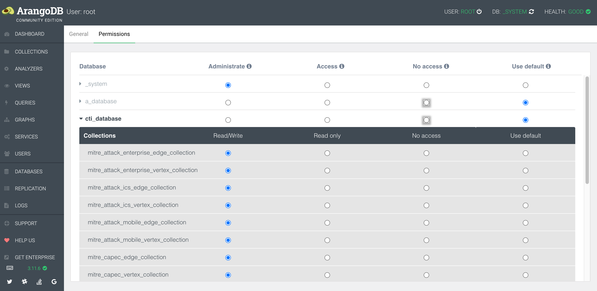

# Vulmatch

## Overview

Vulmatch is a database of CVEs in STIX 2.1 format with a REST API. Some common reasons people use Vulmatch include 

* filter CVEs by CVSS and/or EPSS scoring
* get a list of CVEs being exploited (CISA KEV)
* search for CVEs by CPEs (i.e. "what CVEs am I vulnerable to?")
* search for CVEs by Weakness

## The backend

Vulmatch stores the following data in an ArangoDB to power the API;

* CVE records stored on Cloudflare (created by a Github action in cxe2stix_helper) and updated automatically each day
* CPE records stored on Cloudflare (created by a Github action in cxe2stix_helper) and updated automatically each day
* Vulmatch also downloads and stores a copy of MITRE CWEs from Cloudflare updated on demand

The user can define the database in the `.env` file, however, it expects the following collection to exist in the named database:

* NVD CVE: `nvd_cve_vertex_collection`/`nvd_cve_edge_collection`
* NVD CPE: `nvd_cpe_vertex_collection`/`nvd_cpe_edge_collection`
* MITRE CWE: `mitre_cwe_vertex_collection`/`mitre_cwe_edge_collection`

## Daily jobs to get new/updated CVEs/CPEs

[This code requires cxe2stix_helper to be running on github to store cves/cpes on cloudflare via a github action](https://github.com/muchdogesec/cxe2stix_helper).

Every day, after the Cloudflare R2 bucket is queried (after Github action is run) to pull the daily CPE and CVE bundle.

These are then added to the database by [stix2arango](https://github.com/muchdogesec/stix2arango/). This will either add new objects, or update existing CVE records if updates have happened in the last day.

CWE bundles are manually added when updates happen, as these updates tend to happen only twice a year.

## A note on CPE search logic

CPE strings follow the structure:

```
cpe:2.3:<part>:<vendor>:<product>:<version>:<update>:<edition>:<language>:<sw_edition>:<target_sw:>:<target_hw>:<other>
```

CPE strings allow for wildcards (`*`) to be used for a value, e.g.

```txt
cpe:2.3:a:microsoft:windows_live_messenger:*:*:*:*:*:*:*:*
```

For example any `version` that exists, that would match...


```txt
cpe:2.3:a:microsoft:windows_live_messenger:8.5:*:*:*:*:*:*:*
cpe:2.3:a:microsoft:windows_live_messenger:8.6:*:*:*:*:*:*:*
```

etc.

Sometimes you will also see a `-` value in the CPE string, which means no value exists for the property. For example `cpe:2.3:a:vendor:product:-:*:*:*:*:*:*:*` would mean there is a product but it is never versioned by the vendor.

## API

### Users / Authentication / Permissions

Authentication is managed by ArangoDB.


Under the `_system` database, admin users can add or remove other users from the system.



Each user has a username and password.

These values are used to authenticate against the API, using basic auth in the header of each request;

```
Authorization: Basic <credentials>
```

Users can also be assigned permissions on a database and Collection level.



A user must have read permissions to the database you specify for them to view the collections within it.

You can control wether a user can view the collections inside the database (e.g. only allow them to see some collections), although in most cases you want to grant users read permissions to all collections in the named database.

There are no write actions performed via the API, so write access is not required for any user.

### Schema

To make it easy for users to get up and running, we should build the API against the OpenAPI v3 spec (https://spec.openapis.org/oas/v3.1.0). We can then use Swagger (https://swagger.io/resources/open-api/) to automatically deliver a lightweight view to allow users to interact with the API in the browser.

### Pagination

We should add an `.env` variable that allows user to set max record returned per page.

All paginated responses should contain the header;

```json
{
    "page_number": "<NUMBER>",
    "page_size": "<SET IN ENV>",
    "page_results_count": "<COUNT OF RESULTS ON PAGE>",
    "total_results_count": "<COUNT OF RESULTS ON ALL PAGES>",
```

### Endpoints

#### CVE Objects

##### GET CVEs

```shell
GET <HOST>/api/v1/cve/
```

Accepts URL parameters:

* `id` (stix id): The STIX ID(s) of the object wanted (e.g. `vulnerability--1234`)
* `cve_id` (optional): ID of CVE (e.g. `CVE-2023-22518`)
* `description` (stix description): The description if the object. Is wildcard
* `created_min` (optional, in format `YYYY-MM-DDThh:mm:ss.sssZ`): is the minumum `created` value user wants
* `created_max` (optional, in format `YYYY-MM-DDThh:mm:ss.sssZ`): is the maximum `created` value user wants
* `modified_min` (optional, in format `YYYY-MM-DDThh:mm:ss.sssZ`): is the minumum `modified` value user wants
* `modified_max` (optional, in format `YYYY-MM-DDThh:mm:ss.sssZ`): is the maximum `modified` value user wants
* `has_kev` (optional, boolean), only returns CVEs that are reported by CISA KEV
	* this essentially searches for embedded relationships between sighting (`object-refs`) and CVE Vulnerability
* `cpes_vulnerable` (optional, cpe string), only returns results for which matching CPEs are vulnerable to matching CVEs
	* this essentially searches for CPE relationships to indicator with relationship_type = `in-vulnerable`
	* note, if wildcard value used, will consider any values for property. user must pass vendor and product not as wildcard values in string. Can omit end of string (rest will be treated as wildcard values)
* `cpes_in_pattern` (optional, cpe string), only returns results for which matching CPEs are found in CVE pattern
	* this essentially searches for CPE relationships to indicator with relationship_type = `in-pattern`
	* note, if wildcard value used, will consider any values for property. user must pass vendor and product not as wildcard values in string. Can omit end of string (rest will be treated as wildcard values)
* `cvss_base_score_min` (optional, between `0`-`10`)
	* searches for minimum base scores for v2_0, v3_0, v3_1 and v4_0 Vulnerability object
* `epss_score_min` (optional, between `0`-`1` to 2 decimal places)
* `epss_percentile_min` (optional, between `0`-`1` to 2 decimal places)
* `weakness_id` (optional, cwe id): list of CWEs that are linked to CWEs
* `page_size` (max is 50, default is 50)
* `page`
    * default is 0
* `sort`:
    * modified_ascending
    * modified_descending (default)
    * created_ascending
    * created_descending
    * name_ascending
    * name_descending
    * epss_score_ascending
    * epss_score_descending
    * cvss_base_score_ascending
    * cvss_base_score_descending

This endpoint only returns the vulnerability object for matching CVEs, they must query the CVE ID endpoint for full information

```json
{
	"vulnerabilities": [
		"<PRINTED STIX VULNERABILITY OBJECT 1>",
		"<PRINTED STIX VULNERABILITY OBJECT N>"
	]
}
```

Possible errors:

* 400 - The server did not understand the request
* 401 - The client needs to authenticate
* 404 - Not found, or the client does not have access to the resource

##### GET CVE

```shell
GET <HOST>/api/v1/cves/:cve_id/
```

This endpoint prints all objects that representing the vulnerability and those directly linked (Weaknesses) to it.

You can see those here:

https://miro.com/app/board/uXjVKo1Efx0=/

200:

```json
{
	"objects": [
		"<STIX OBJECT 1>"
	]
}
```

Possible errors:

* 401 - The client needs to authenticate
* 404 - Not found, or the client does not have access to the resource

#### CPE Objects

##### GET CPEs

```shell
GET <HOST>/api/v1/cpe/
```

Accepts URL parameters:

* `id` (stix id): The STIX ID(s) of the object wanted (e.g. `software--1234`)
* `type` (stix type): The STIX object `type`(s) of the object wanted (e.g. `software`).
	* available options are `software`,`identity`, `marking-definition`
* `cpe_match_string` (optional): ID of CVE (e.g. `cpe:2.3:o:microsoft:windows_10`). Can use wildcards or can omit end of string (rest will be treated as wildcard values)
* `product_type` (optional, uses cpe match string 2nd part): either `application`, `hardware`, `operating-system`
* `vendor` (optional, uses cpe match string 3rd part)
* `product` (optional, uses cpe match string 4th part)
* `in_cve_pattern` (optional, list of CVE ids): only returns CPEs in CVE Pattern
* `cve_vulnerable` (optional, list of CVE ids): only returns CPEs vulnerable to CVE
* `page_size` (max is 50, default is 50)
* `page`
    * default is 0
* `sort`:
    * vendor_ascending
    * vendor_descending (default)
    * product_ascending
    * product_descending

```json
{
	"objects": [
		"<PRINT SOFTWARE STIX OBJECT 1>",
		"<PRINT SOFTWARE STIX OBJECT N>"
	]
}
```

Possible errors:

* 400 - The server did not understand the request
* 401 - The client needs to authenticate
* 404 - Not found, or the client does not have access to the resource

##### GET CPE

```shell
GET <HOST>/api/v1/cpes/:cpe_match_string
```

:cpe_match_string cannot contain wildcard. Must match an existing CPE match string in a stix object exactly.

200:

```json
{
	"objects": [
		"<PRINT SOFTWARE STIX OBJECT 1>"
	]
}
```

Possible errors:

* 401 - The client needs to authenticate
* 404 - Not found, or the client does not have access to the resource

#### arango_cti_processor

These endpoints will trigger the relevant arango_cti_processor mode to generate relationships.

Each request generates a job.

##### Run `cve-cpe`

```shell
POST <HOST>/api/v1/arango_cti_processor/cve-cpe
```

URL parameters;

* `--created_min` (`YYYY-MM-DD`): will only update objects with a `created` time >= to date passed
	* default is `1980-01-01`
* `--modified_min` (`YYYY-MM-DD`): will only update objects with a `modified` time >= to date passed
	* default is `1980-01-01`

A 201 response returns the job id

##### Run `cve-cwe`

```shell
POST <HOST>/api/v1/arango_cti_processor/cve-cwe
```

URL parameters;

* `--created_min` (`YYYY-MM-DD`): will only update objects with a `created` time >= to date passed
	* default is `1980-01-01`
* `--modified_min` (`YYYY-MM-DD`): will only update objects with a `modified` time >= to date passed
	* default is `1980-01-01`

A 201 response returns the job id

##### Run `cve-epss`

```shell
POST <HOST>/api/v1/arango_cti_processor/cve-epss
```

URL parameters;

* `--created_min` (`YYYY-MM-DD`): will only update objects with a `created` time >= to date passed
	* default is `1980-01-01`
* `--modified_min` (`YYYY-MM-DD`): will only update objects with a `modified` time >= to date passed
	* default is `1980-01-01`

A 201 response returns the job id

##### Get Jobs

```shell
POST <HOST>/api/v1/arango_cti_processor/jobs
```

Url parameters

* `page_size` (max is 50, default is 50)
* `page`
    * default is 0

Shows job info

```json
{
  "page_size": 50,
  "page_number": 3,
  "page_results_count": 50,
  "total_results_count": 2500,
  "jobs": [
	  	{
			"mode": "<e.g. cve-epss>",
			"created_min": "<created_min>",
			"modified_min": "<modified_min>",
			"datetime_start": "<datetime job triggered>",
			"state": "<state>"
		}
	]
}
```
##### Get Job ID

```shell
POST <HOST>/api/v1/arango_cti_processor/jobs/:job_id
```